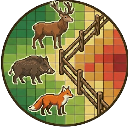
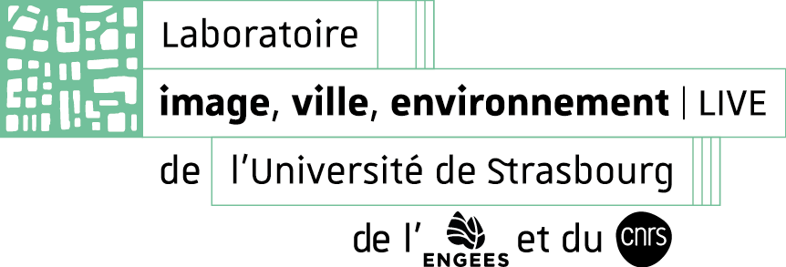
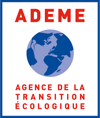

# FricMaps 

[](https://www.gnu.org/licenses/gpl-3.0)
[](https://creativecommons.org/licenses/by/4.0/)
[](https://qgis.org)
[](CHANGELOG.md)

<div align="justify">
  
**FricMaps** is an open-source QGIS plugin that automates the generation of standardised land-cover and **resistance surfaces** for ecological connectivity modelling at 5 m resolution. It turns heterogeneous vector datasets into analysis-ready rasters through a modular vector-preprocessing and rule-based rasterisation workflow, exporting surfaces directly compatible with connectivity-modelling tools such as [Graphab](https://sourcesup.renater.fr/www/graphab/).

</div>

## Description

<div align="justify">
  
Resistance surfaces are the backbone of ecological connectivity modelling, but building them is hard to reproduce: the input data are heterogeneous — different producers, schemas and vintages — and the preprocessing and parameter choices are rarely documented.

FricMaps addresses this by standardising the whole chain. Heterogeneous national and open datasets are harmonised through a modular vector-preprocessing workflow, then converted into land-cover and resistance rasters by a rule-based rasterisation engine. Every thematic decision — land-cover classes, resistance values, compilation order — is defined in a single user-editable classification table, so the mapping from data to surface is explicit and fully documented rather than hidden in code.

Beyond standard land cover, the workflow explicitly integrates underrepresented anthropogenic barriers such as fences, applies attribute-dependent buffering of roads and railways, and uses wildlife crossing structures (e.g. BD ORFeH) to locally restore permeability at validated locations. Contextual weighting by slope and urban influence, together with built-in scenario generation, makes FricMaps suited to reproducible, scenario-based connectivity assessments over large administrative extents.

</div>

## Features

<div align="justify">

- **Automated preprocessing** — heterogeneous national datasets (OCS GE, RPG, BD TOPO®, RGE ALTI®, BD ORFeH) are queried, clipped and harmonised into consistent thematic layers, ready for rasterisation at 5 m.
- **Attribute-dependent buffering** — roads and railways are turned into polygonal rights-of-way whose width is derived from their attributes, so barrier footprints are represented realistically rather than as uniform lines.
- **Conditional permeability** — validated wildlife crossings (BD ORFeH) locally erase overlapping transport infrastructure, keeping barriers continuous except at functional crossing nodes; fences and photovoltaic parks are integrated as underrepresented anthropogenic barriers.
- **Data-driven rasterisation** — a single user-editable classification table (CSV: source, SQL filter, priority, class code, resistance value) drives the output through a hierarchical stacking engine, yielding both a land-cover map and a resistance surface without touching the code.
- **Custom sources & weighting** — register any extra vector dataset from the interface, and modulate the baseline resistance by slope (Sobel, from the DEM) or distance to any class or source, through user-defined bands.
- **Scenario generation** — alternative surfaces (no fences, no linear transport infrastructure, no barriers) are produced by local value replacement, avoiding artificial discontinuities and re-running the vector stage.
- **Built on the QGIS stack** — PyQGIS for vector, GDAL for raster I/O, NumPy for weighting; no external dependency, and fully scriptable through the Processing algorithm `fricmaps:build_surfaces`.
- **Practitioner-oriented** — bilingual GUI (English/French, light/dark themes), dual Shapefile/GeoPackage compatibility, and every parameter recorded in the logs for traceability.

</div>

## Requirements

- QGIS **3.28 LTR** or newer (tested up to 3.3x)
- No external Python dependency: the plugin relies solely on PyQGIS, GDAL and the native Processing algorithms shipped with QGIS

## Installation

Only the `fricmaps_plugin/` folder is the plugin. It is self-contained, so it installs on its own.

**From a ZIP, inside QGIS.** Build the archive, then use *Plugins → Manage and Install Plugins → Install from ZIP*:

```bash
zip -r fricmaps_plugin.zip fricmaps_plugin -x "*__pycache__*" -x "*.DS_Store"
```

**By hand.** Copy `fricmaps_plugin/` into your QGIS plugins directory:

- **Linux**: `~/.local/share/QGIS/QGIS3/profiles/default/python/plugins/`
- **Windows**: `C:\Users\YourUser\AppData\Roaming\QGIS\QGIS3\profiles\default\python\plugins\`
- **macOS**: `~/Library/Application Support/QGIS/QGIS3/profiles/default/python/plugins/`

Then restart QGIS and enable **FricMaps** in the Plugin Manager.

<blockquote>
<div align="justify">
`fricmaps_plugin/` must sit directly in the plugins directory: QGIS uses the folder name as the Python module name, so an intermediate folder produces an invalid name and the plugin fails to load. Zipping from the macOS Finder also adds a `__MACOSX` folder that QGIS tries to load as a plugin — build the archive from a terminal, as above.
 
</div>
</blockquote>

## Input data
 
<div align="justify">
FricMaps is built around the French national datasets, in either Shapefile or GeoPackage delivery:
 
</div>

| Dataset | Used for | Download |
|---------|----------|----------|
| **OCS GE** | Land-cover base layer | [cartes.gouv.fr - OCS GE](https://cartes.gouv.fr/rechercher-une-donnee/dataset/IGNF_OCS-GE) |
| **BD TOPO®** | Buildings, roads, railways, hydrography, vegetation, hedgerows, built-up areas | [carte.gouv.fr - BD Topo®](https://cartes.gouv.fr/rechercher-une-donnee/dataset/IGNF_BD-TOPO) |
| **RPG** | Agricultural parcels | [carte.gouv.fr - RPG](https://cartes.gouv.fr/rechercher-une-donnee/dataset/IGNF_RPG) |
| **RGE ALTI®** | Digital elevation model, for slope weighting | [cartes.gouv.fr - RGE Alti®](https://cartes.gouv.fr/rechercher-une-donnee/dataset/IGNF_RGE-ALTI) |
| **BD ORFeH** *(optional)* | Wildlife crossing structures | [FRC Occitanie — Via Fauna](https://carto.frcoccitanie.fr/lm/index.php/view/map/?repository=occitanie&project=00020_ORFEH) *(full GIS version on agreement)* |
 
<div align="justify">
  
Point the plugin at the directory holding these datasets: sub-folders are scanned recursively, so the delivery tree does not need to be reorganised. Any other dataset can be added through the custom-sources mechanism.
 
**Data sources and credits.** OCS GE, BD TOPO® and RGE ALTI® are © IGN, available under the *Etalab 2.0* Open Licence. The RPG is © IGN / ASP, under the *Etalab 2.0* Open Licence. The BD ORFeH database is produced by the *Via Fauna* project (FRC Occitanie - 2023), the full GIS version is available under agreement. Fence data can be derived from [OpenStreetMap](https://www.openstreetmap.org) (© OpenStreetMap contributors, ODbL) or from predictive layers.

</div>

## Test dataset
 
<div align="justify">
A ready-to-run example dataset is provided so the workflow can be reproduced end to end without assembling the national data. It covers a small study area and includes the source layers, the classification table and the expected output rasters.
 
</div>


**Download:** [Seafile — FricMaps test dataset](https://seafile.unistra.fr/d/edfa7faab9ca448d866f/)

 
<div align="justify">
  
Unzip the archive, point the plugin's **base data directory** to the extracted folder, and run the four stages.
 
</div>

## Usage
 
<div align="justify">
The plugin can be run from its interface or, for reproducible workflows, as the Processing algorithm `fricmaps:build_surfaces` (see [`docs/SCRIPTING.md`](docs/SCRIPTING.md)). The interface follows the four stages of the workflow.
 
</div>

<p align="center">
  
</p>
<div align="justify">
  
**1 — Vector processing.** Define the study area (a project layer or a file), the name field and the value identifying your territory, then the base data directory and the output directory. An optional buffer around the study area limits edge effects in the connectivity graph. At this stage, heterogeneous source layers are automatically queried, clipped, harmonised and — for linear features such as roads, railways, hedgerows or streams — converted into polygonal footprints so they are effectively represented at the target resolution. Any additional dataset can be declared here as a custom source.
 
**2 — Rasterization.** Edit the classification and resistance matrix that drives the whole thematic content of the output. Each row is a geospatial rule; a hierarchical stacking engine rasterises the rows by priority, so higher-priority elements (e.g. roads) overwrite lower-priority ones (e.g. land cover):
 
</div>

| Column | Meaning |
|--------|---------|
| `CLASS_NAME` | Class name |
| `COMPILATION_ORDER` | Stacking priority — higher values are rasterised last and overwrite lower ones |
| `DESCRIPTION` | Free-text description |
| `SOURCE` | Dataset the class is drawn from |
| `SQL_FILTER` | Optional SQL expression restricting the class to a subset of features |
| `FRICTION_VALUE` | Resistance value; low means permeable, high means costly to cross |
 
<p align="center">
  
</p>

<div align="justify">
  
The matrix is a semicolon-separated CSV, editable in place or loaded from disk; a default table of 39 classes is provided in `fricmaps_plugin/resources/`. Editing it recalibrates the whole run — new classes, land-use scenarios or resistance profiles — without touching the code. This stage produces two rasters: a land-cover map and the associated baseline resistance surface.
 
**3 — Weighting.** Apply contextual weightings on top of the baseline resistance. Each rule targets the slope (from the DEM) or the distance to any class or custom source, through user-defined bands and multipliers — the mechanism used to model topographic cost or the diffuse deterrence of human presence. A factor of `1.0` is neutral; below 1 makes a zone more permeable. The run, including the *no fences* / *no linear transport infrastructure* / *no barriers* scenarios, is launched from the bottom of this tab.
 
**4 — Logs.** Follow the run step by step. Each stage reports its retained feature count — the fastest way to confirm a dataset was read correctly — and every parameter, threshold and scenario is recorded for traceability and reproducibility.
 
</div>

## Outputs

The output directory holds only the deliverables, with `<area>` the cleaned study-area name:

| File | Content |
|------|---------|
| `Land_Cover_<area>.tif` | Land-cover raster, one integer code per class |
| `Friction_<area>.tif` | Base friction raster, straight from the classification table |
| `Friction_Weighted_<area>.tif` | Friction surface after weighting and bias correction |
| `Scenario_No_Fences_<area>.tif` | Scenario without fences |
| `Scenario_No_LTI_<area>.tif` | Scenario without linear transport infrastructure |
| `Scenario_No_Barriers_<area>.tif` | Scenario without either |

Everything else — the clipped vector layers, the digital elevation model, the per-step weighting rasters and the scratch folders — is written to an `intermediate/` sub-folder. Nothing is discarded, so a run remains fully auditable, but the deliverables stay easy to find.

Output filenames are in English regardless of the interface language, so that scripts, figures and published protocols remain valid across locales.

## Repository layout

```
fricmaps_plugin/     THE PLUGIN - zip this folder, or drop it into the QGIS
                     plugins directory. It is self-contained.
  __init__.py          classFactory, called by QGIS on load
  metadata.txt         plugin metadata read by QGIS
  icon.png             toolbar icon
  main_plugin.py       menu/toolbar registration, Processing provider
  dialog.py            graphical interface
  processing_*.py      scriptable algorithm and its provider
  core/                data preparation, rasterisation, weighting, helpers
  resources/           default classification table, interface images
docs/                user guide and design notes
README.md            this file
LICENSE              GPL-3.0-or-later (code) + CC BY 4.0 (docs and data)
CHANGELOG.md         release history
CITATION.cff         citation metadata
pyproject.toml       formatting and linting configuration
```

## Documentation

- [`docs/GENERIC_SOURCES_ARCHITECTURE.md`](docs/GENERIC_SOURCES_ARCHITECTURE.md) — design of the data-driven custom-source system
- [`docs/GENERIC_SOURCES_IMPLEMENTATION.md`](docs/GENERIC_SOURCES_IMPLEMENTATION.md) — delivered behaviour and a worked example
- [`docs/SCRIPTING.md`](docs/SCRIPTING.md) — running the whole workflow from a script
- [`CHANGELOG.md`](CHANGELOG.md) — release history

## Citation

If you use FricMaps in academic work, please cite it. Citation metadata is provided in [`CITATION.cff`](CITATION.cff), and GitHub can generate a formatted citation from the *Cite this repository* button.

## Contributing

Bug reports and feature requests are welcome through the [issue tracker](https://github.com/a-kumm/FricMaps/issues). When reporting a processing problem, please attach the content of the **Logs** tab: it contains the resolved paths and per-step feature counts needed to reproduce the case.

## License

FricMaps uses a split licence, which is standard practice for scientific software:

| Material | Licence |
|----------|---------|
| **Source code** | [GNU GPL v3.0 or later](LICENSE) |
| **Documentation, classification table, figures** | [CC BY 4.0](LICENSE) (PART 2) |

The code is released under the GPL because FricMaps builds on QGIS, which is itself distributed under the GPL v2 or later; this is also a requirement of the official QGIS plugin repository. The documentation and the default classification table are released under CC BY 4.0 so that they can be freely reused, adapted and cited in scientific work, provided attribution is given.

Partner logos in `fricmaps_plugin/resources/` remain the property of their respective organisations and are not covered by either licence.

---

## Partners

<div align="center">
  
  &nbsp;&nbsp;&nbsp;&nbsp;
  
  &nbsp;&nbsp;&nbsp;&nbsp;
  
  &nbsp;&nbsp;&nbsp;&nbsp;
  
</div>

<p align="center">
  <i>Developed as part of the Polymor-FENCE project (ADEME, 2024-2026).</i>
</p>
